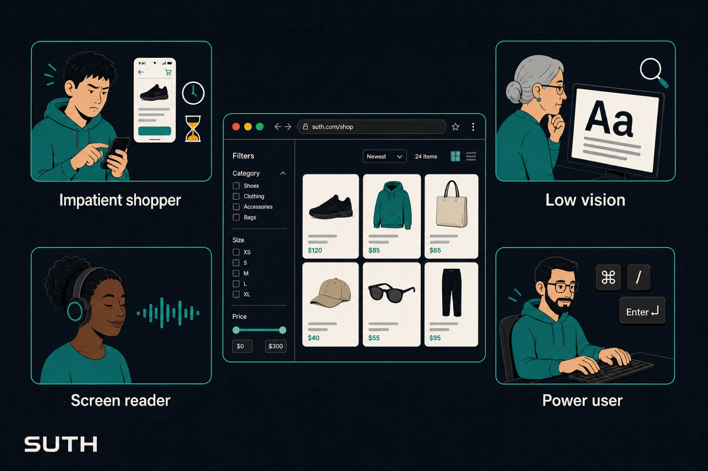

<div align="center">
  

  <h1>SUTH</h1>
  <p><strong>Synthetic User Test Harness</strong></p>
  <p><em>An automated, ruthless UX critic — personas, not scripts.</em></p>

  <p>
    <a href="https://github.com/seacar/suth/blob/main/LICENSE"></a>
    <a href="https://www.python.org/downloads/"></a>
    <a href="https://playwright.dev"></a>
    <a href="https://github.com/seacar/suth/stargazers"></a>
  </p>
</div>

<br>

It drives a real browser with an LLM-backed persona, plays out an objective
against your app, and logs a scored transcript — where the persona got stuck,
what it clicked instead, and why it gave up. Point it at a PR preview or a
local dev server and it reports back like an impatient real user would, not a
passing/failing selector.

<table>
  <tr>
    <td width="50%" valign="top">

**Personas, not scripts**

An impatient mobile shopper, a screen-reader-only user, a non-native speaker, a
power user — each with its own patience budget and abandonment triggers,
driving a real Chromium browser via Playwright.

    </td>
    <td width="50%" valign="top">

**Friction, not pass/fail**

A friction score and failure taxonomy, plus rage-quit / stall / loop
detection, so a UX regression shows up as a number that moves.

    </td>
  </tr>
  <tr>
    <td width="50%" valign="top">

**CI-ready**

Gate a PR on a friction-score regression against a baseline session, run
several personas in parallel as one batch, export the full transcript as JSON.

    </td>
    <td width="50%" valign="top">

**MCP + REST + web app**

Drive it from an agent (Claude Code or any MCP-aware client), a CI pipeline, or
a small Next.js dashboard for watching runs live.

    </td>
  </tr>
</table>

<details>
<summary><strong>Contents</strong></summary>

- [Getting started](#getting-started)
- [MCP server](#mcp-server)
- [Personas](#personas)
- [Local Control API + web app](#local-control-api--web-app)
- [Tests](#tests)
- [Layout](#layout)
- [Contributing](#contributing)
- [License](#license)
- [Support the project](#support-the-project)

</details>

## Getting started

1. **Clone and set up the Python environment**

   ```bash
   git clone https://github.com/seacar/suth.git
   cd suth
   uv venv .venv --python 3.11
   uv pip install -e ".[dev]" --python .venv/bin/python
   .venv/bin/playwright install chromium
   ```

2. **Local infrastructure** (Postgres + object storage, via [specific.dev](https://specific.dev))

   ```bash
   specific dev
   ```

   Leave this running in a terminal — it provisions a local Postgres instance
   and S3-compatible storage and keeps them up. Everything below that touches
   the database or storage must run through `specific exec cli -- <command>`
   so those env vars are injected.

3. **Apply the schema** (first run only, or after adding a new migration)

   ```bash
   specific exec cli -- .venv/bin/python scripts/migrate.py
   ```

4. **Sanity-check the DB connection**

   ```bash
   specific exec cli -- .venv/bin/python scripts/check_db.py
   ```

5. **Local LLM backend** (the only provider implemented so far — Anthropic/
   OpenAI secrets are wired up in `specific.hcl` for future adapters, but
   `ollama` is what `suth_config.json`'s `llm_providers` block should point at
   today)

   ```bash
   ollama pull gemma4
   ```

6. **Sync the persona library into Postgres** (source of truth is the YAML
   under `src/suth/personas/library/`; the CLI reads personas from Postgres,
   not the filesystem, unless `--no-db` is passed)

   ```bash
   specific exec cli -- .venv/bin/python scripts/sync_personas.py
   ```

7. **Run the harness** against a target project's `suth_config.json`:

   ```bash
   specific exec cli -- .venv/bin/python run_test.py \
     --config suth-test-app/suth_config.json \
     --objective "Filter the listings to find one under \$50,000." \
     --headless
   ```

   [`suth-test-app`](suth-test-app) is a throwaway project nested inside this
   repo, with a deliberately bad control, kept specifically to exercise the
   harness end to end. Serve it first: `python3 -m http.server 8765` from
   that directory.

   Useful flags: `--step` pauses for a keypress after every state-machine
   step; `--watch PATH` re-runs whenever a file/directory changes; `--persona`
   picks a specific persona from the library (`impatient-mobile-shopper-v2`,
   `elderly-low-vision-v1`, `screen-reader-only-v1`, `non-native-speaker-v1`,
   `power-user-v1`); `--expect-dom-text`/`--expect-url-pattern` add a
   Driver-side objective assertion (Silent Failure detection); `--export-transcript
   PATH` dumps the full transcript as JSON; `--compare-baseline SESSION_ID
   --regression-threshold N` gates on a friction-score regression and exits
   non-zero — see [`examples/ci`](examples/ci) for a full GitHub Actions setup.

8. **Multiple personas at once**: `--personas a,b,c` (comma-separated) runs
   them in parallel — queued past the concurrency cap rather than rejected —
   as one grouped batch with a combined summary table. With neither
   `--persona` nor `--personas` given, it falls back to *all* of
   `suth_config.json`'s `default_personas` (not just the first, unlike a
   single-persona config where that's the same thing):

   ```bash
   specific exec cli -- .venv/bin/python run_test.py \
     --config suth-test-app/suth_config.json \
     --objective "Filter the listings to find one under \$50,000." \
     --personas power-user-v1,elderly-low-vision-v1,non-native-speaker-v1 \
     --headless
   ```

   `--step`/`--export-transcript`/`--compare-baseline` only apply to
   single-persona runs (ignored, with a note, in batch mode — there's no
   single session to export/compare/step through). One persona's failure
   (e.g. a transient LLM-provider error) doesn't hide the others' results;
   it's reported per-row with `ERROR` in place of a verdict, and the batch
   exits non-zero if any member failed.

## MCP server

Any MCP-aware agent (including a Claude Code session working on a *different*
project) can call the harness as a tool. Projects must be pre-registered in
[`mcp_projects.json`](mcp_projects.json) (project_id → `suth_config.json`
path) — a caller can never point a session at an arbitrary URL.

```bash
# stdio (Claude Code / Claude Desktop) — use an absolute path to this checkout
claude mcp add suth "$(pwd)/bin/mcp_stdio.sh" -s user

# HTTP (remote/CI callers), bearer tokens from the `mcp_caller_tokens` secret
# as a JSON object: {"token": "caller_id"}
specific exec cli -- .venv/bin/uvicorn suth.mcp_server.http_app:app
```

Tools: `list_projects`, `list_personas`, `create_persona`, `run_audit`,
`run_audit_matrix` (same as `run_audit` but takes `persona_ids: list[str]` and
fans out in parallel as one batch — see below), `get_session_status`,
`get_session_report`, `compare_runs`. Both audit tools restrict `environment`
to `ci`/`agent` — `dev` is always rejected. Resources: `session://{id}/transcript`,
`session://{id}/screenshots/{step}`, `session://{id}/video`, `persona://{id}`. See
`scripts/mcp_client_demo.py` for a worked example using a real
(separate-process) MCP client.

## Personas

Source of truth is the YAML under `src/suth/personas/library/` (git-tracked);
`scripts/sync_personas.py` pushes it into Postgres, versioned (an edit +
re-sync creates a new version, never overwrites one a past session actually
ran against) — everything else (CLI, API, MCP) reads personas from Postgres,
not the filesystem. The web app's Personas tab and the `create_persona`
tool/endpoint are the other way in, writing straight to Postgres through the
same validated path.

**Known gap:** `personas.project_id` exists in the schema for project-scoped
personas, but nothing currently sets it — every persona today is global,
shared across all projects.

## Local Control API + web app

A FastAPI service wrapping the same Orchestrator, for manual dev runs to
become visual/ambient (`specific dev` already runs it as the `api` service,
default `http://localhost:3001`):

```bash
specific exec cli -- .venv/bin/uvicorn suth.api.app:app   # standalone
```

- REST mirrors the MCP tool set: `GET /projects`, `GET /personas`,
  `POST /personas`, `POST /runs`, `GET /runs/{id}/status|report|transcript`,
  `POST /batches` (multi-persona — see below), `GET /batches/{id}`,
  `GET /sessions/recent`, `GET /compare`.
- `WS /runs/{id}/stream` — live step events; if the run was started with
  `step_through`, the run blocks after each step until the client
  `POST`s `/runs/{id}/continue`. A batch's members each get their own
  stream at this same endpoint, keyed by their own session_id — no separate
  batch-streaming endpoint needed.
- `WS /events` — every session's completion, from any process (CI, MCP,
  another dev's CLI run) — polls Postgres every 2s since that's the only
  state every surface actually shares.
- CORS is enabled for `CORS_ORIGIN` (the `web` service's own origin, wired
  through `specific.hcl`) so the web app can call the API directly from the
  browser — falls back to `*` when that env var is unset (e.g. running
  `uvicorn` standalone).
- [`web/`](web) — a Next.js app that's a thin client over this same API:
  Run page with live transcript (solo + parallel batch runs), History with a
  sparkline and transcript detail, Compare, a persona editor, and
  notifications on *any* session's completion. `specific dev` runs it as the
  `web` service; standalone, `cd web && npm run dev`.

## Tests

```bash
scripts/run_tests.sh              # unit tests only, no DB needed
specific exec cli -- .venv/bin/python -m pytest   # includes the Postgres smoke test
```

## Layout

```
src/suth/
  personas/       persona schema, YAML loader + Postgres repository, built-in library
  brain/          LLM Router: StepDecision schema, provider interface, prompt, Ollama adapter
  driver/         Playwright wrapper: DOM snapshot, action executor, origin/keyboard guardrails
  abandonment.py  abandonment-rule evaluator (rage quit / stall / loop detection)
  taxonomy.py     post-session failure-taxonomy classifier
  scoring.py      friction-score formula
  session.py      the 6-step state machine loop
  orchestrator/   queue + concurrency/budget enforcement — the one implementation
                  of "run a session" that the CLI (and, later, MCP/API) calls into
  compare.py      compare_runs() — CI regression diff between two sessions
  watch.py        `--watch` file-watch/re-run loop
  db.py           Postgres read/write (Memory), incl. budgets
  storage.py      screenshot upload to object storage
  config.py       suth_config.json loader/validator
  cli.py          run_test.py's implementation
  mcp_server/     MCP server: tools/resources (server.py), HTTP+bearer-auth (http_app.py),
                  project allowlist (registry.py)
  api/            Local Control API: FastAPI app (app.py), sync-thread<->async-WS
                  bridge (events.py)

examples/ci/      GitHub Actions templates for a target project's PR-gating CI
mcp_projects.json server-side allowlist of project_id -> suth_config.json path
web/              Next.js web app — a thin client over the Local Control API
```

## Contributing

Issues and PRs are welcome. Run `scripts/run_tests.sh` before sending a PR;
if you touch the schema, add a migration under `migrations/` and mention it
in your PR description.

## License

[MIT](LICENSE)

---

<div align="center">
  <h2>Support the project</h2>
  <p>
    If SUTH caught a UX bug before a real user did — or you just like having a
    ruthless synthetic critic on the payroll — consider donating to help
    keep the lights on and the personas impatient.
  </p>
  <p>
    <a href="https://seacar.ai/donate?source=github-suth" target="_blank" rel="noopener noreferrer"></a>
  </p>
</div>
